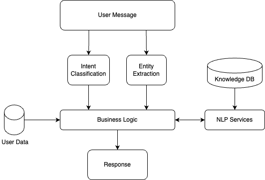

Chatbot Overview
=====
Chatbots can be Rule-Based or Conversational. Rule-based chatbots are those that interact with the user in a deterministic way, such as with the help of buttons, form elements, widgets, etc. Whereas conversational bots take user input in natural language, which bot then understands and generates responses with the help of NLP/AI techniques.
A typical chatbot solution comprises the following components:

- **Chat Interface:** From where the end users can interact. There are plenty of popular interfaces available such as WhatsApp, Telegram, Line, etc. Swiftchat is one of them but it's novel for hosting bots.
- **Chatbot Backend:** Responsible for handling user inputs received from the Chat interface and responding accordingly.
- **NLP Services:** Utlised for user's intent classification and response generation. It processes user queries using natural language processing techniques when the user communicates in natural language. 
- **Database:** Stores user data, manages knowledge, and maintains chat history and logs

Chatbot Flow
~~~~~~~~~~~~~~~~~~~~~~~

Architecture
~~~~~~~~~~~~~~~~~~~~~~~
A typical Chatbot architecture can be visualized on AWS as follows:

.. image:: ../images/deployement_images/image.png
   :alt: Deployment Structure
   :width: 500
   :height: 500
   :align: center

Chatbot Backend
----------------
The Chatbot Backend serves as the core application responsible for managing user interactions on the Swiftchat Platform. Its key responsibilities include:

- Implementing logic for various use cases
- Utilizing Swiftchat APIs to engage with users
- Leveraging NLP Backend services for natural language query processing
- Managing user preferences and chat history

This backend suffices for Rule-Based bots where natural language processing is unnecessary.

NLP Backend Services
---------------------
This module handles natural language queries using generative AI technologies such as OpenAI or open-source LLMs. Its typical services include:

- Ingesting and managing knowledge within the Vector database
- Generating responses to queries posed in natural language using LLM services like OpenAI
- Caching results to optimize LLM service costs

Vector Database
---------------

The Vector Database stores text embeddings (vectors) retrievable based on semantic similarity. It is used to store:

- Documents such as PDFs, text files, and strings, serving as knowledge for bot responses
- Cache results from OpenAI or other LLM services

Logging, Health Check, Data Analytics
--------------------------------------

AWS CloudWatch facilitates monitoring infrastructure health, including server logs and resource utilization.

An Alarm service can be set up to receive alerts for unexpected issues. Key metrics to monitor include:

- EC2 Instances Utilization
- Request Counts

