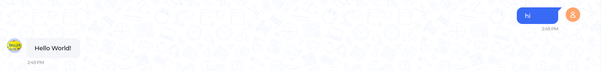
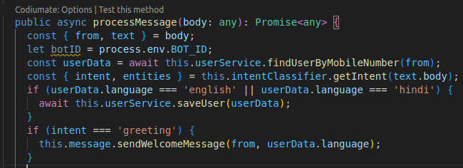

Hello World!
------------------

All set up! With the bot created and updated settings, it's time to start the bot. Follow these basic steps:

1. Navigate to cloned starter-kit and open the terminal
2. Use these commands one by one:
   
   - ``cd chatbot-nestjs-boilerplate``
   - ``npm run start:dev``
  
3. Open the bot interface and send the message **hi**. The bot should respond with a welcome message.
   

Work Flow
^^^^^^^^^^^^^^^^^^^^^^^
   

1. The **processMessage** method is responsible for handling incoming messages received by the chatbot. It takes the message body as input and extracts important information such as the sender's ID (`from`) and the text of the message (`text`). 

2. First, it retrieves the bot's ID from the environment variables. Then, it fetches user data based on the sender's ID using the **findUserByMobileNumber** method provided by the **UserService**. 

3. Next, it uses an intent classifier to determine the intent and extract entities from the message text. The intent represents the purpose or goal of the message, while entities are specific pieces of information mentioned in the message.

4. If the user's language is either English or Hindi, the user data is updated and saved using the **saveUser** method.

5. Finally, if the intent is a greeting, the **sendWelcomeMessage** method is called to send a welcome message to the sender, considering their preferred language.

Overall, this method orchestrates the processing of incoming messages, including extracting information, determining intent, updating user data, and responding accordingly.

