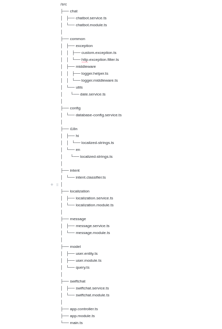

Starter Kit Structure
====================

Let's take a look at the organization of our Chatbot Starter Kit repository, which has been meticulously structured to enhance usability and navigation.

At present, the starter kit comprises two primary folders and one file, which are outlined below:

- **/src:** Within this directory lies the core source code of the chatbot application. This is where you'll primarily focus your efforts, developing and tailoring the logic of your chatbot.

- **/tests:** Housed here are the test cases and testing utilities crucial for validating the reliability and functionality of your chatbot. Emphasizing the writing of tests is essential for upholding code quality standards.

- **/.env:** The `.env` file serves as a pivotal configuration file, housing environment variables vital for your chatbot application. It's utilized for defining sensitive data such as API keys, database credentials, and other configuration values that shouldn't be hardcoded in your source files. Ensuring the secure handling of this file and refraining from sharing sensitive information publicly is paramount.

Overview of src folder
------------------------
The **src** folder is further organized into multiple subfolders and files. Please refer to the attached image below for a visual representation.

- **/chat**

  - **chatbot.service.ts:** Manages chatbot-related functionalities such as processing user input and generating responses.
  - **chatbot.module.ts:** Defines the module for the chatbot service, organizing related components, directives, and services.

- **/common**

  - **exception**

    - **custom.exception.ts:** Contains custom exceptions for specific scenarios.
    - **http-exception.filter.ts:** Handles HTTP exceptions, providing appropriate error messages or redirects.
  
  - **middleware**

    - **logger.helper.ts:** Helper functions for logging.
    - **logger.middleware.ts:** Middleware for logging requests and responses.
  
  - **utils**

    - **date.service.ts:** Utility functions for working with dates.

- **/config**

  - **database-config.service.ts:** Configures database connections and settings.

- **/i18n**

  - **hi**
    - **localized-strings.ts:** Localization strings for Hindi.

  - **en**
    - **localized-strings.ts:** Localization strings for English.

- **/intent**

  - **intent.classifier.ts:** Logic for classifying user intents.

- **/localization**

  - **localization.service.ts:** Handles localization logic.
  - **localization.module.ts:** Module for localization-related services.

- **/message**

  - **message.service.ts:** Manages chatbot messages.
  - **message.module.ts:** Module for message-related services.

- **/model**

  - **user.entity.ts:** Entity definition for user data.
  - **user.module.ts:** Module for user-related functionality.
  - **query.ts:** Logic for executing database queries.

- **/swiftchat**

  - **swiftchat.service.ts:** Service for SwiftChat-related functionality.
  - **swiftchat.module.ts:** Module for SwiftChat-related services.

- **app.controller.ts:** Handles application-level routes.
- **app.module.ts:** Main module of the application, importing various modules and components.
- **main.ts:** Entry point of the application, initializing and starting the server.
