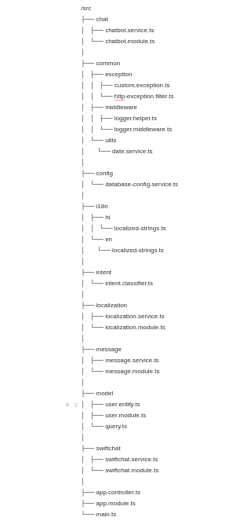

Starter Kit Structure
====================

Let's take a look at the organization of our Chatbot Starter Kit repository, which has been meticulously structured to enhance usability and navigation.

- **/src:** Within this directory lies the core source code of the chatbot application. This is where you'll primarily focus your efforts, developing and tailoring the logic of your chatbot.

- **/tests:** Housed here are the test cases and testing utilities crucial for validating the reliability and functionality of your chatbot. Emphasizing the writing of tests is essential for upholding code quality standards.

- **/.env:** The `.env` file serves as a pivotal configuration file, housing environment variables vital for your chatbot application. It's utilized for defining sensitive data such as API keys, database credentials, and other configuration values that shouldn't be hardcoded in your source files. Ensuring the secure handling of this file and refraining from sharing sensitive information publicly is paramount.

