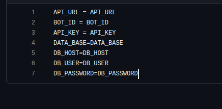

Start Your Bot
====================

All setup!. Now the bot has been created and deployed, so we can start the bot now. 
Follow these basics steps:

1. Open the cloned repository in your preferred code editor and 
2. Navigate to **i18n** folder then navigate to the **en** and **hn** files and 
3. Update welcome message and push the code.
4. Take latest pull on AWS terminal and start the machine once again.
5. Open the bot and send **hi**. The bot should start and show you a welcome message like this.
   

