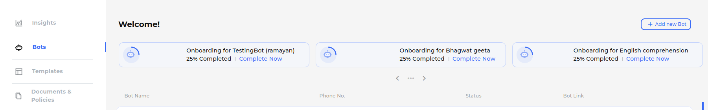

.. _swiftchat_bot_setup:
Setting Up a New Bot
====================
To begin utilizing the starter kit, you'll need to obtain a bot ID. You can create a chatbot either manually or via API.

Creating a Bot Using the SwiftChat API
------------------------
------------------------
The SwiftChat APIs act as the conduit between your chatbot and yourself, processing your data accordingly. 

You can employ any tool or platform to interact with the SwiftChat APIs. In this instance, we'll demonstrate using **Postman**.

**Steps**

1. Open Postman or any other API Platform
2. Create a new **POST** request
3. Add this API ``https://v1-api.swiftchat.ai/api/bots`` in the url section
4. Open the authorization section and here add your API key that we generated or got in `Obtaining API Key <get_api_key.html>`_
   
   .. image:: ../images/create_bot_images/create_bot_auth.png
      :alt: Deployment Structure
      :width: 1300
      :height: 300
      :align: center
   

5. Now move to **Body** tab, and add details like, bot-name, mobile-number, and bot-category.

   .. image:: ../images/create_bot_images/create_bot_body.png
      :alt: Deployment Structure
      :width: 1300
      :height: 300
      :align: center

6. On successfully creating bot you will receive a message **created** and status code **OK**

   .. image:: ../images/create_bot_images/successful_bot.png
      :alt: Deployment Structure
      :width: 1300
      :height: 100
      :align: center

7. After creating bot, use the `**varify API** <https://documenter.getpostman.com/view/20587790/UyrGCuhH#a5fa0876-d1b1-48de-a475-dad2ff467071>`_ and varify your bot. This will generate the bot ID.

Creating a Bot Using the SwiftChat Dashboard
------------------------
You can also create bot using your SwiftChat Merchant Dashboard

**Steps:**

1. Login to your `SwiftChat Merchant Dashboard <https://dashboard.swiftchat.ai/bots>`_.
   

.. tip:: 

   - Create your merchant account using this Post `API <https://documenter.getpostman.com/view/20587790/UyrGCuhH#57d73550-1c15-41a5-ac7e-0ba20b60b3e4>`_ 
   - Complete business KYC and email varification

2. Click on **Add New Bot** button.

3. Clicking **Add New Bot** button will redirect you to a page where you can input the bot details, including the phone number, bot name, and bot type.Enter these details and proceed for verification. Once verification is completed, the bot will be created and activated.

.. image:: ../images/create_bot_images/bot_detail.png
   :alt: Deployment Structure
   :width: 1300
   :height: 500
   :align: center

4. Copy the bot link and save it for future reference. The link should resemble this format: 
   - **https://cgweb.page.link/?link=https%3A%2F%2Fweb.convegenius.ai%3FbotId%3D0216260609726241&apn=ai.convegenius.app**. 
   - In the link, the bot ID is structured as **botId%3D0216260609726241**, where the actual ID follows the "3D" prefix. So here the ID is **0216260609726241**.

