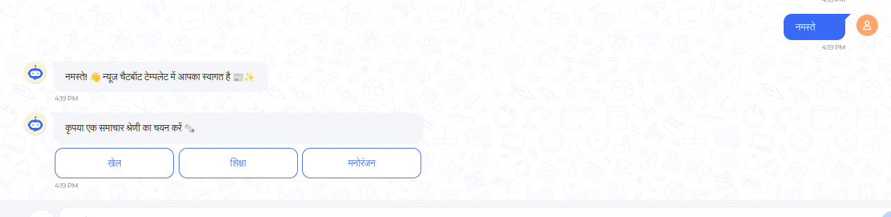
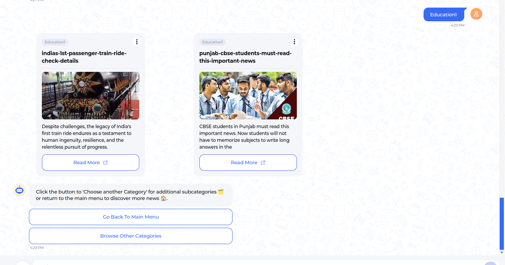
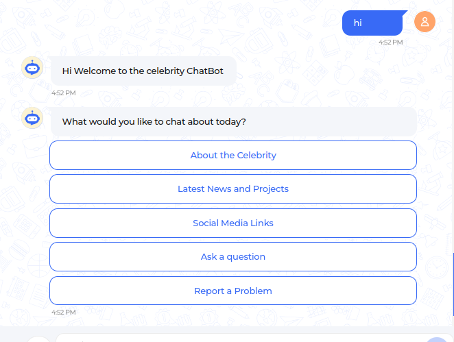
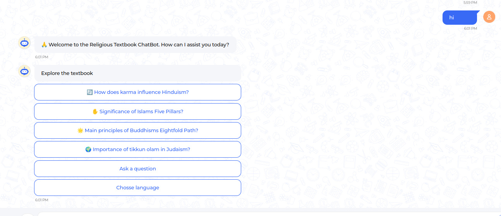

Here, you'll discover our most popular templates for various bots, along with their features. This document will walk you through the straightforward process of personalizing the template to fit your needs and crafting your very own distinctive chatbot.

News bot template
===================

Our user-friendly news bot template is designed to simplify the process of creating your personalized news chatbot. This template offers intuitive customization options, allowing you to tailor the chatbot to your specific needs and preferences.

Key features of the news bot template include:

- Customizable news category buttons such as Sports, Education, etc., tailored to your preferences.
- Sub-categories within each news category, allowing users to explore specific topics within a broader category.
- Convenient "Go back to main menu" option, enabling users to easily navigate between different news categories at any time.
- Latest news presented in card format, providing users with highlights or summaries, with the option to read more if desired.
- Bilingual language support in Hindi and English, ensuring accessibility to a wide range of users.

**Welcome Message with category buttons:** 

--------------------------------

**News in the card format with sub-category option:**

.. image:: ../images/template_images/news_category.png
        :alt: Deployment Structure
        :width: 3000
        :height: 500
        :align: left  

--------------------------------

**Sub-category news with options to "Go back to main menu" and "Browse other categories":** 

--------------------------------

Celebrity bot template
=========================

The Celebrity Template offers a dynamic source for engaging with audiences on the latest updates, news, and insights surrounding the world of celebrities. With its simple interface and customizable features, this template empowers users to curate personalized experiences that resonate with their audience.

Key features of the Celebrity bot template include:

- Introduce interactive and customizable buttons providing information about celebrities. These buttons include options like "About the Celebrity," "Social Media Contacts," and "Ask a Question," enhancing engagement.
- Ensure accessibility to a broader user base by offering bilingual language support in both Hindi and English.
- Enable easy navigation with "Go Back to Main Menu" options, facilitating seamless interaction and quick access to the main menu.
- Empower users to inquire more about their favorite celebrities through the "Ask a Question" feature, fostering deeper engagement.
- Include a "Report a Problem" option, allowing users to flag issues and concerns to be addressed by the celebrities.

**Welcome message with menu buttons:**

--------------------------------

Religious textbook template
===============================

The Religious Textbook Template is crafted to provide information about specific religious texts such as the Bhagavad Gita and the Quran. It features an engaging interface to explore and deepen understanding of your chosen religious text.

The main features comprise:

- A welcoming message accompanied by a set of pre-defined questions in button format to initiate interaction.
- The template allows users to inquire either from the pre-defined questions or input new queries.
- Convenient navigation back to pre-defined questions with the "Go Back" option.
- Language support in both Hindi and English ensures readability for a wide range of users.
- Users can switch languages at any point for added convenience.

**Welcome message with pre-defined questions:**

--------------------------------

Explore further details about these templates and find customization steps in our `repositories <resources.html>`_

